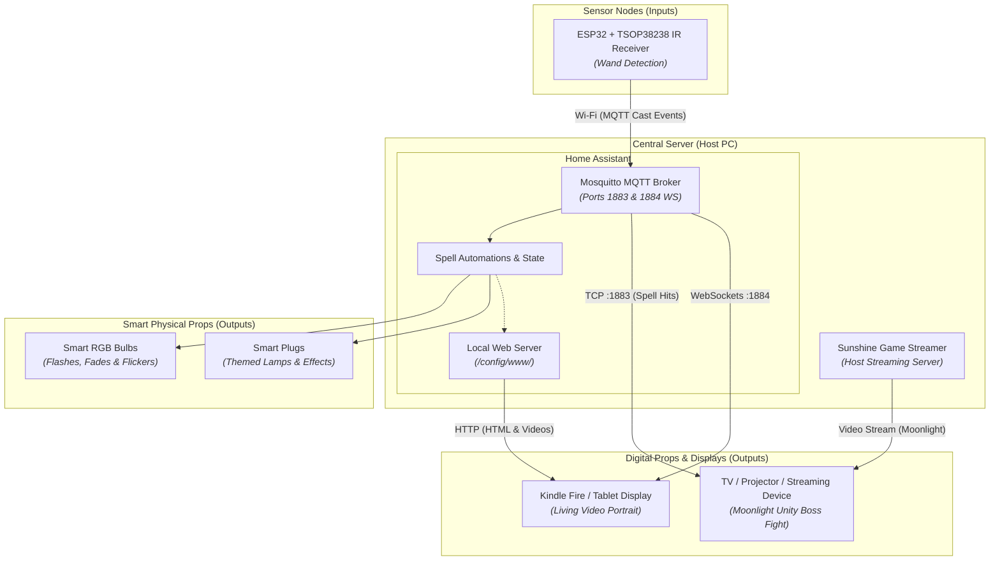

# 🪄 MythicHome: MagiQuest Home Automation & Adventure System

Transform your living space into an interactive fantasy realm using real **MagiQuest** infrared wands, ESP32 microcontrollers, Home Assistant, and interactive digital props.

MythicHome bridges the physical and digital worlds: flick your wand to trigger room-wide lighting spells, battle 3D animated dragons streamed to your television, and awaken living portraits on framed tablets.

---

## 🌟 Key Features

* **Decoupled Architecture:** Sensor nodes (inputs) detect wand flicks independently and publish standard JSON events over MQTT. Digital and physical props (outputs) subscribe and react autonomously.
* **Flick Magnitude & Spell Classification:** MicroPython decodes the raw 48-bit MagiQuest IR pulse protocol, distinguishing between subtle flicks (**Lightning**) and forceful casts (**Fireball**).
* **Home Assistant Integration:** Coordinates spell cooldowns, triggers smart plugs and bulbs, and sequences complex light transitions with ember flickers and cool-downs.
* **Interactive 3D Boss Battles (Unity + Moonlight):** A complete Unity boss encounter featuring health bars, spell particle VFX, sound effects, and auto-reset, streamed from a host PC to any TV or projector via Sunshine/Moonlight.
* **Living Video Portrait Frame:** An always-on Amazon Kindle Fire tablet running a lightweight HTML5/JavaScript web app that seamlessly crossfades between idle and reaction video clips over direct MQTT WebSockets.

---

## 🏗️ System Architecture



---

## 📁 Modular Documentation & Repository Structure

Each major subsystem contains its own dedicated documentation and guides:

```text
MythicHome/
├── docs/
│   └── hardware_bom.md                 # Full Bill of Materials & purchasing guide
├── home_assistant/
│   ├── README.md                       # Mosquitto broker setup & automation guide
│   ├── fireball_spell_automation_guide.md  # Explosive color transitions & delays
│   ├── home_assistant_spell_automation_guide.md # Transition timing & toggle logic
│   ├── lightning_spell_automation_guide.md # Rapid flash & strobe sequences
│   └── wizard_lighting/                # Phone dashboard & fantasy scene scripts
├── props/
│   ├── README.md                       # Overview of digital & physical props
│   ├── magic_picture/
│   │   ├── kindle_fire_setup_guide.md  # Silk browser developer settings & setup
│   │   └── magic_picture_index.html    # HTML5/JS dual-video player with MQTT WS
│   └── unity_scenes/
│       └── Scripts/                    # Unity C# scripts for Moonlight boss battle
└── receivers/
    ├── README.md                       # Wand IR protocol & sensor node firmware hub
    ├── enclosure_housing_guide.md      # Wooden treasure box assembly instructions
    └── esp32/
        ├── dual_spell_mqtt_publisher.py    # Production dual-spell classifier
        ├── single_spell_mqtt_publisher.py  # Single-topic basic publisher
        ├── ir_receiver_wand_decoder.py     # Standalone terminal IR pulse decoder
        ├── hardware_assembly_guide.md      # Pinouts & wiring schematics
        ├── firmware_flashing_testing_guide.md # Flashing MicroPython & Thonny setup
        └── esp32_treasure_box_setup_checklist.md # Production deployment checklist
```

---

## 🛠️ Hardware & Bill of Materials (BOM)

MythicHome uses off-the-shelf, hobbyist-friendly electronics and smart home devices:

* **MagiQuest Wands:** Any standard 38kHz IR wand from Great Wolf Lodge or Creative Kingdoms.
* **Sensor Nodes:** ESP32 development boards paired with TSOP38238 38kHz infrared receiver modules.
* **Smart Props:** Zigbee / Wi-Fi RGB bulbs and smart plugs integrated with Home Assistant.
* **Digital Props:** Amazon Kindle Fire tablet (living portrait) and Moonlight-compatible streaming devices (TV, Apple TV, Fire TV Stick).

👉 **For the complete component list, specifications, and purchasing links, see the [Hardware & Bill of Materials Guide](docs/hardware_bom.md).**

---

## 📡 The MagiQuest Wand IR Protocol

When flicked, MagiQuest wands emit a **48-bit transmission** over a 38kHz infrared carrier:
* **Bits 0–31 (32 bits):** Unique Wand ID (player identification).
* **Bits 32–47 (16 bits):** Flick Magnitude (physical cast intensity).

The ESP32 firmware measures pulse widths and classifies flicks:
* **Magnitude $\ge$ 200:** Published to `mythichome/events/cast/fireball` (Heavy Flick).
* **Magnitude < 200:** Published to `mythichome/events/cast/lightning` (Light Flick).

👉 **For full protocol timings, pulse-width modulation details, and MQTT JSON payloads, see [receivers/README.md](receivers/README.md).**

---

## 🚀 System Setup Guide

Because MythicHome is modular, setup is divided into distinct subsystems:

### Step 1: Build the Sensor Nodes
Follow the **[Receivers Guide](receivers/README.md)** to:
1. Flash MicroPython onto your ESP32 boards.
2. Wire the TSOP38238 IR receiver to GPIO 18 and 3.3V.
3. Configure your Wi-Fi and MQTT credentials in `dual_spell_mqtt_publisher.py`.
4. Assemble the board into a craft treasure box enclosure.

### Step 2: Configure Home Assistant & MQTT Broker
Follow the **[Home Assistant Guide](home_assistant/README.md)** to:
1. Install the Mosquitto broker add-on with ports `1883` (TCP) and `1884` (WebSockets) active.
2. Import the YAML lighting automations for Fireball and Lightning effects.
3. Link your physical smart bulbs and smart plugs.

### Step 3: Deploy Props
Follow the **[Props Guide](props/README.md)** to:
1. **Living Portrait:** Set up the Kindle Fire tablet with Silk Browser and place `magic_picture_index.html` in your Home Assistant `/config/www/` folder.
2. **Unity Boss Fight:** Set up the Unity dragon encounter and stream it to your TV using Sunshine and Moonlight.

---

## 🗺️ Project Roadmap

- [x] **Phase 1: Foundation & Smart Plug Controller**
  - Mosquitto MQTT broker setup.
  - MicroPython MagiQuest IR pulse decoder.
  - Basic Home Assistant lamp toggles.
- [x] **Phase 2: Debounce & Physical Enclosure**
  - 3-second cooldown debounce logic.
  - Wooden treasure box sensor housing.
- [x] **Phase 3: Digital Encounters**
  - Unity Dragon combat prototype with live MQTT spell damage.
  - Kindle Fire "Living Portrait" HTML5 client over WebSockets.
  - Sunshine/Moonlight streaming integration.
- [ ] **Phase 4: Advanced Actuators & Multi-Node Quests (Upcoming)**
  - Servo-driven treasure chest lock/unlock mechanism.
  - Addressable WS2812B LED spell beam strips across walls.
  - Multi-step quest state machine tracking player wand IDs and progress in Home Assistant.

---

## 🤝 Contributing

Contributions, issues, and creative prop ideas are welcome! If you build your own custom prop, sensor housing, or Home Assistant sequence:
1. Fork the Project.
2. Create your Feature Branch (`git checkout -b feature/AmazingProp`).
3. Commit your Changes (`git commit -m 'Add new potion bottle prop'`).
4. Push to the Branch (`git push origin feature/AmazingProp`).
5. Open a Pull Request.

---

## 📄 License

Distributed under the **MIT License**. See [LICENSE](LICENSE) for more information.
