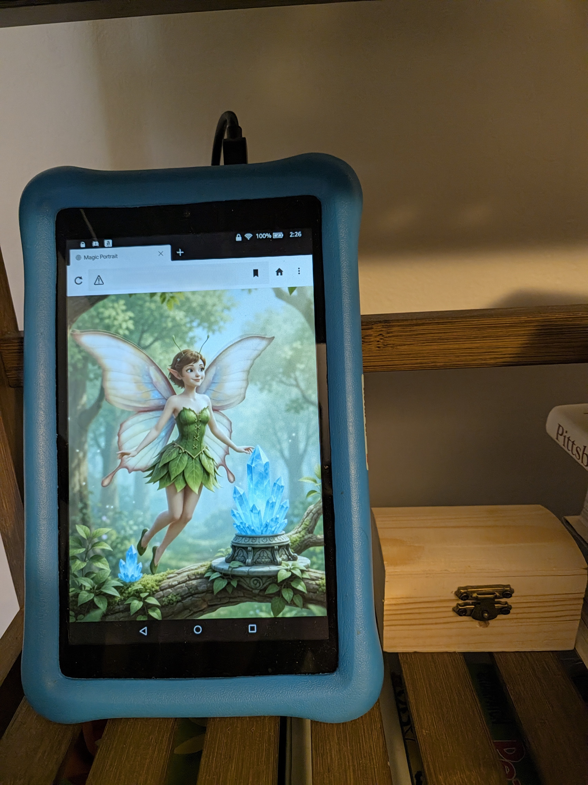

# 🎭 MythicHome: Physical & Digital Props

Props in MythicHome are divided into **Physical Smart Props** (smart lights, smart plugs, mechanical actuators) and **Digital Props** (streaming 3D game encounters and living video portraits).

All props subscribe directly to MQTT topics or are orchestrated by Home Assistant automations.

---

## 🖼️ Digital Prop: Living Video Portrait Frame (`magic_picture/`)

An old Amazon Kindle Fire tablet mounted on a wall or stand acts as an interactive magical painting that reacts to wand flicks.

  
*Figure: The Kindle Fire living portrait prototype on a display shelf with the disguised treasure chest receiver.*

* **Technology:** Vanilla HTML5, CSS crossfades, and Paho MQTT over WebSockets (`ws://<YOUR_HOME_ASSISTANT_IP>:1884`).
* **Display Hardware:** Amazon Fire 7" or 8" tablet using the native **Silk Browser**.
* **Behavior:** Loops an idle video (`serena_idle.mp4`). When a wand event (`/fireball` or `/wave`) is received over WebSockets, it seamlessly crossfades to a reaction video (`serena_wave.mp4`) and returns smoothly to idle.
* **Guides & Files:**
  * **[Kindle Fire Setup Guide](magic_picture/kindle_fire_setup_guide.md):** Developer Options configuration, keeping the screen awake indefinitely, and Home Assistant local web server paths.
  * **[magic_picture_index.html](magic_picture/magic_picture_index.html):** The standalone HTML/JavaScript player for `/config/www/portrait/`.

---

## 🐉 Digital Prop: 3D Boss Battles via Moonlight (`unity_scenes/`)

Interactive real-time 3D boss encounters streamed directly from your gaming desktop to any television, projector, or streaming device. Both scenes live inside a single shared Unity project and compile into separate standalone executables.

* **Technology:** Unity 3D Engine + `M2Mqtt` + **Sunshine** (host streamer) + **Moonlight** (client receiver).
* **Display Hardware:** Any TV or projector connected to an Apple TV, Fire TV Stick 4K, Nvidia Shield, onn. 4K Streaming Box, or mini PC running the Moonlight client.
* **Encounter 1: Meadow Dragon (`Scripts/DragonCombatManager.cs` & `DragonSpellReceiver.cs`):**
  * Flick-speed combat: Light flicks cast **Lightning**, heavy flicks cast **Fireball**.
  * Depletes the Dragon's health bar, triggers hit VFX/SFX, plays death animation at 0 HP, and reloads on the next wand cast.
* **Encounter 2: Cavern Dragon Tactical Fight (`Scripts/CavernBattle/`):**
  * **Phone Spellbook + Wand Cast:** Players tap a spell button on their phone dashboard (`🔥 Fireball`, `⚡ Lightning`, `❄️ Ice Spear`, or `🛡️ Arcane Shield`) to load that spell into their wand, then flick the wand to fire!
  * **Dragon Flame Armor & Shield Breaker:** The Dragon periodically summons an impenetrable shield. Normal attacks bounce off until the player equips and casts **❄️ Ice Spear** to shatter it!
  * **Dragon Breath Telegraph & Player Shield:** The Dragon winds up fiery breath attacks with an on-screen countdown warning. The player must equip and cast **🛡️ Arcane Shield** in time to block the damage!
  * **[Cavern Dragon & Multi-Executable Setup Guide](unity_scenes/cavern_dragon_setup_guide.md):** Full instructions for scene setup and one-click dual `.exe` building (`MultiSceneBuilder.cs`).

---

## ⚡ Physical Smart Props

* **Smart RGB Bulbs:** Environmental room lighting that pulses, Strobes (Lightning), or swells and flickers (Fireball). Controlled via Home Assistant automations.
* **Smart Plugs:** Toggling ambient items such as themed lamps, UV blacklights, sound machines, or fog machines.

---

## 🔮 Phase 4 Actuator Roadmap

* **Servo-Driven Treasure Chest Latch:** An SG90 micro servo integrated into a wooden chest to physically unlock and pop the lid when a correct spell sequence is cast.
* **Addressable WS2812B Spell Strips:** Wall-mounted LED strips running WLED or ESP32 firmware to simulate beams of magical energy traveling from the wand sensor to props.

