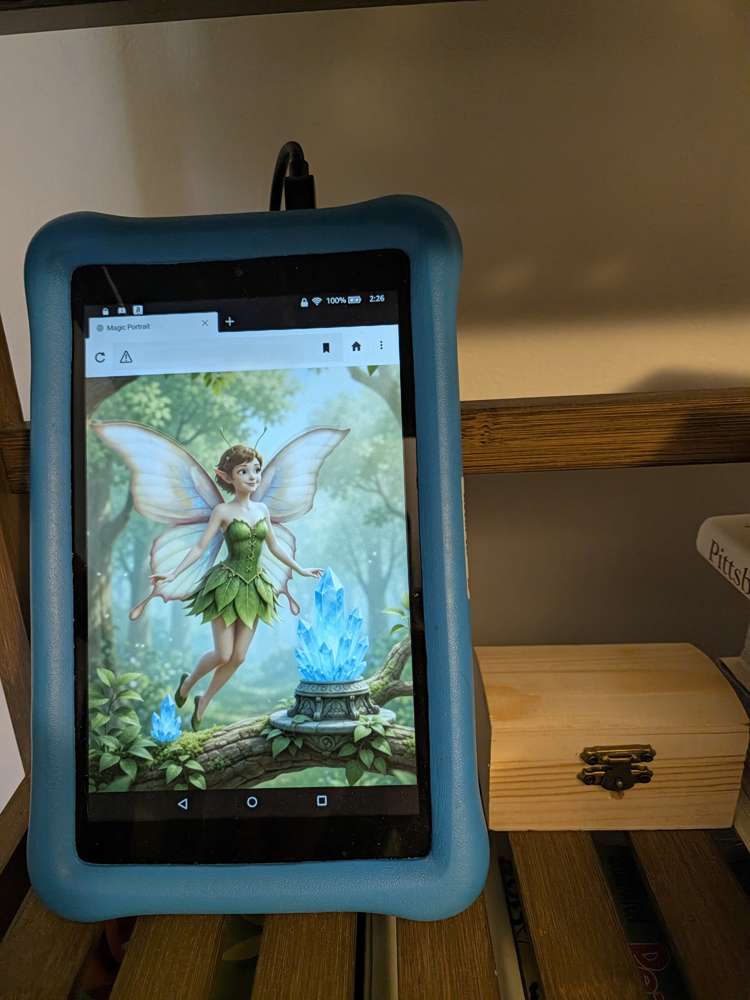

# Magic Picture Frame: Kindle Fire Setup Guide

This guide covers how to set up an Amazon Kindle Fire tablet as an always-on, interactive magic portrait using the native Silk Browser and direct MQTT WebSockets. No sideloading or third-party kiosk apps are required.

  
*Figure: The Kindle Fire living portrait mounted on a shelf alongside the disguised treasure chest sensor node.*

---

## 1. Keep the Screen Awake (Developer Options)

Fire tablets aggressively put the screen to sleep. We must override this so the portrait never turns off while mounted on the wall/stand.

1. Open the tablet's **Settings**.
2. Go to **Device Options**.
3. Tap on the **Serial Number** 7 times rapidly. A message will appear saying "You are now a developer."
4. Press the back button. You will now see a new **Developer Options** menu.
5. Open **Developer Options** and turn the master switch **ON** at the top.
6. Find and toggle **Stay Awake (Screen will never sleep while charging)** to **ON**.

*Note: The tablet must remain plugged into a power source for the screen to stay on indefinitely.*

## 2. Prepare Home Assistant (Host)

Ensure your HTML and video files are correctly placed in your Home Assistant VM using the Studio Code Server (or File Editor) add-on.

**Required File Structure:**
```text
config/
  └── www/
       └── portrait/
            ├── index.html
            ├── idle.mp4
            └── wave.mp4
```

*Crucial Step:* If you just created the `www` folder for the first time, you **must** restart Home Assistant (`Settings > System > Restart`) before it will serve files to the local network.

## 3. Verify MQTT WebSockets

The `index.html` file uses Paho MQTT to connect to your broker over WebSockets.
* Ensure your Mosquitto MQTT Broker add-on in Home Assistant has WebSockets enabled (this is usually on by default on Port `1884`).
* Ensure lines ~53-54 in your `index.html` correctly point to your Home Assistant VM's IP address:
  ```javascript
  const brokerIP = "<YOUR_HOME_ASSISTANT_IP>"; // Your HA IP
  const brokerPort = 1884;                     // WebSocket Port
  ```

## 4. Launching the Portrait

1. Open the native **Silk Browser** on the Fire tablet.
2. In the URL bar, type the direct local path to your Home Assistant server. It will look like this:
   `http://<YOUR_HOME_ASSISTANT_IP>:8123/local/portrait/index.html`
3. Once the page loads, you should see your `idle.mp4` video looping.
4. **Interaction Requirement:** Browsers block auto-playing video/audio until a user interacts with the page. **Tap the screen once** anywhere on the video. This satisfies the browser's requirement and allows the JavaScript to seamlessly crossfade the videos when a spell is cast.

## 5. Testing

Flick your wand! 
If everything is connected, the ESP32 will send the spell to Mosquitto (Port 1883), and Mosquitto will instantly broadcast it over WebSockets (Port 1884) to the Silk Browser, triggering the `wave.mp4` video.