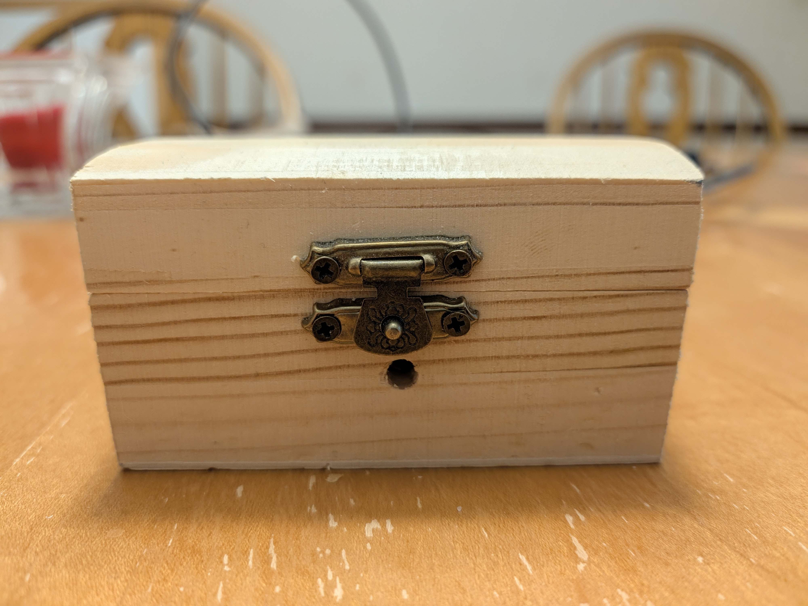

# 📡 MythicHome: Sensor Nodes & MagiQuest IR Protocol

This directory contains the firmware, wiring guides, protocol documentation, and enclosure instructions for the **MythicHome Sensing Nodes**.

---

## 🪄 The MagiQuest Wand IR Protocol

MagiQuest wands use unencoded **38kHz modulated infrared** signals. When flicked, an internal ball/spring switch triggers the wand's microchip to broadcast a sequence of pulses.

### 1. Transmission Anatomy
A valid wand cast consists of a **48-bit packet** transmitted MSB (most significant bit) first:

```text
┌──────────────────────────────────────────────┬──────────────────────────────┐
│             Bits 0 – 31 (32 bits)            │    Bits 32 – 47 (16 bits)    │
│                 Wand ID                      │        Cast Magnitude        │
└──────────────────────────────────────────────┴──────────────────────────────┘
```

* **Wand ID (32 bits):** A unique identifier assigned to each wand. Allows the game server to recognize individual players.
* **Magnitude (16 bits):** An integer measuring the physical acceleration/force of the flick. Gentle flicks typically register between `50` and `150`; energetic flicks register `200` to `400+`.

### 2. Pulse-Width Modulation (Timings)
The TSOP38238 receiver pulls its data pin **LOW (0)** whenever a 38kHz IR carrier is detected. Pulse duration determines bit values:

| Logic Bit | Mark Duration (`time_pulse_us`) | Typical Window |
| :---: | :---: | :---: |
| **Logic `0`** | ~280 µs | `150 µs – 400 µs` |
| **Logic `1`** | ~560 µs | `420 µs – 850 µs` |

Pulses outside these bounds are discarded as ambient IR noise.

---

## ⚡ Spell Classification: Dual-Spell Logic

Rather than treating every flick identically, `dual_spell_mqtt_publisher.py` splits casts into two spell tiers based on flick magnitude:

```text
                        ┌───────────────────┐
                        │   IR Cast Event   │
                        └─────────┬─────────┘
                                  │
                       Is Magnitude >= 200?
                                  │
                 ┌────────────────┴────────────────┐
                 ▼ YES                             ▼ NO
    ┌───────────────────────────┐     ┌───────────────────────────┐
    │     FIREBALL SPELL        │     │     LIGHTNING SPELL       │
    │      (Heavy Flick)        │     │       (Light Flick)       │
    │  mythichome/events/cast/  │     │  mythichome/events/cast/  │
    │          fireball         │     │         lightning         │
    └───────────────────────────┘     └───────────────────────────┘
```

### MQTT JSON Payload Format

Every valid cast publishes a JSON message formatted as follows:

```json
{
  "wand_id": "0x0123ABCD",
  "wand_id_dec": 19114957,
  "magnitude": 284,
  "spell_type": "Fireball (Heavy Flick)",
  "sensor_id": "spell_node",
  "timestamp": 1726850000
}
```

---

## 📂 Firmware Scripts

All firmware runs on **MicroPython** on standard ESP32 boards.

| Script | Purpose | Recommended Use |
| :--- | :--- | :--- |
| **[esp32/dual_spell_mqtt_publisher.py](esp32/dual_spell_mqtt_publisher.py)** | Production firmware: decodes wand, splits by magnitude, and publishes to `/fireball` or `/lightning`. Includes cooldown debouncing and standalone MQTT client. | **Recommended for all interactive rooms.** |
| **[esp32/single_spell_mqtt_publisher.py](esp32/single_spell_mqtt_publisher.py)** | Basic publisher: sends all casts to a single topic (`mythichome/events/cast`). | Use for simple on/off prop triggering. |
| **[esp32/ir_receiver_wand_decoder.py](esp32/ir_receiver_wand_decoder.py)** | Standalone debugging tool: prints decoded wand IDs and magnitudes to the serial REPL without connecting to Wi-Fi or MQTT. | Bench testing and wand identification. |

---

## 🔌 Hardware Wiring & Pinouts

Connecting the **TSOP38238** to the ESP32 requires just 3 wires:

```text
TSOP38238 Pinout (facing the curved lens):
   Pin 1 (OUT)  ──►  ESP32 GPIO 18
   Pin 2 (GND)  ──►  ESP32 GND
   Pin 3 (VCC)  ──►  ESP32 3V3 (3.3V)
```

> [!WARNING]
> Connect VCC to **3.3V**, not 5V. Supplying 5V to the TSOP output pin will exceed the ESP32's 3.3V GPIO input tolerance and can damage the board.

  
*ESP32 and TSOP IR receiver wired on a solderless breadboard (see [Hardware Assembly Guide](esp32/hardware_assembly_guide.md)).*

---

## 📖 Setup & Deployment Guides

Step-by-step guides in this directory:

1. **[Firmware Flashing & Testing Guide](esp32/firmware_flashing_testing_guide.md):** Flashing MicroPython using Thonny or `esptool.py`.
2. **[Hardware Assembly Guide](esp32/hardware_assembly_guide.md):** Physical wiring, pin tables, and bench testing instructions.
3. **[Enclosure & Housing Guide](enclosure_housing_guide.md):** Drilling, mounting, and disguising the sensor inside a craft wooden treasure chest.
4. **[Production Deployment Checklist](esp32/esp32_treasure_box_setup_checklist.md):** Step-by-step verification before placing the node in a room.

  
*Disguised treasure chest sensor node with discreet aperture for the IR lens (see [Enclosure Guide](enclosure_housing_guide.md)).*

