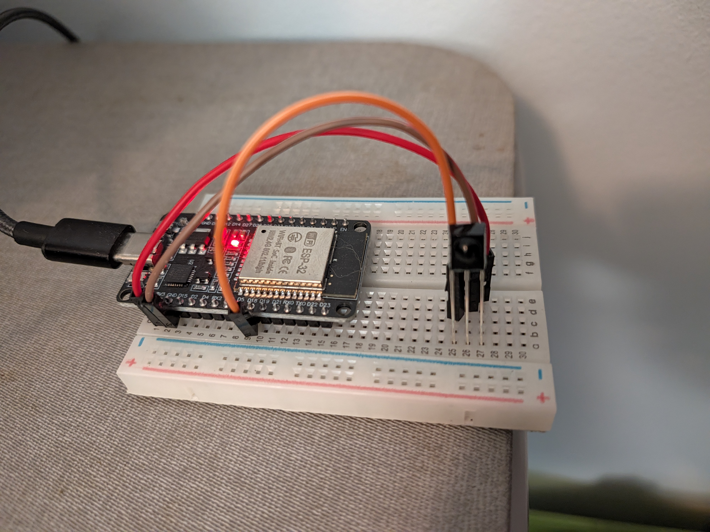
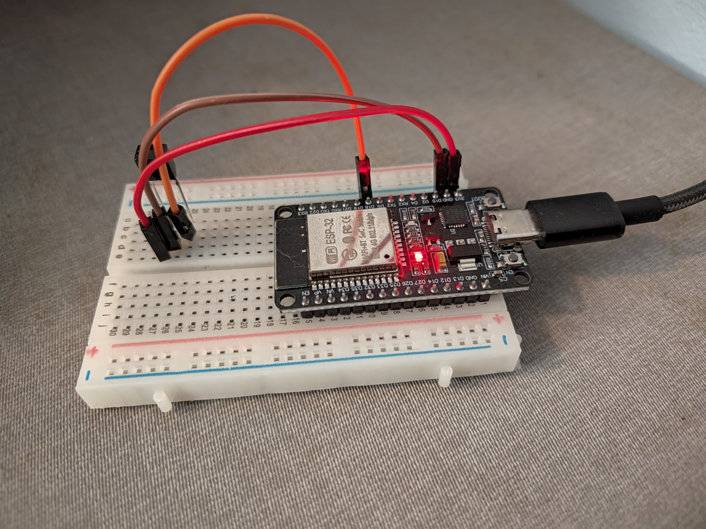

# Phase 1 Prototype Hardware Assembly Guide

This guide details how to wire your **USB-C ESP32 Development Board** and **TSOP4838 IR Receiver** using your **400-point solderless breadboard**.

## 1. How the Breadboard Works

* **Center Trench:** The recessed groove down the middle divides the breadboard into a **Left Bank (columns a–e)** and a **Right Bank (columns f–j)**.

* **Row Connections:** In each numbered row (1–30):

  * Holes `a-b-c-d-e` are connected horizontally beneath the board.

  * Holes `f-g-h-i-j` are connected horizontally on the opposite side of the trench.

  * **CRITICAL:** Do NOT place multiple legs of the same sensor into holes `a`, `b`, and `c` on the same row, as this will short-circuit the legs together!

* **Power Rails:** The long `+` (red) and `-` (blue/black) vertical columns on the outer edges run top to bottom.

## 2. Positioning the ESP32 Board

Because ESP32 development boards are 0.9 inches wide, spanning the central trench leaves limited space on the sides.

### Recommended Offset Placement:

1. Align the ESP32 board over **Rows 1 through 15** at the top of the breadboard.

2. Insert the **left header pins** into **Column B**.

3. Insert the **right header pins** into **Column J**.

```
  [ +  - ]  a  [ B ]  c  d  e  ||  f  g  h  i  [ J ]  [ +  - ]
            │   └─── Left Pins ───┘   └─── Right Pins ───┘
      (Open Hole)                  (Covered under board)

```

* **Left Side Advantage:** **Column `a`** remains completely open along rows 1–15! Any left-side ESP32 pin can be accessed by plugging a standard **Male-to-Male** jumper wire into Column `a` on that pin's row.

* **Right Side Solution:** Columns `f, g, h, i` are physically covered under the body of the ESP32. To connect to any right-side ESP32 pin (like 3V3, GND, or GPIO 18), use a **Female-to-Male** jumper wire attached directly to the top exposed header pin of the ESP32 board.

## 3. Positioning the IR Receiver (TSOP4838)

Place the TSOP4838 sensor near the bottom of the breadboard, using **separate rows** for each pin so they do not short together.

1. Turn the sensor so the **curved lens bubble faces toward you**.

2. Plug the 3 legs into **Column A** across **Rows 25, 26, and 27**:

   * **Pin 1 (Left Leg - OUT / Signal):** Row 25, Column `a`

   * **Pin 2 (Middle Leg - GND):** Row 26, Column `a`

   * **Pin 3 (Right Leg - VCC / 3.3V):** Row 27, Column `a`

## 4. Wiring Connections

Look at the small labels printed on your ESP32 board next to the pins:

| Sensor Function | Sensor Location | Wire Type | Target ESP32 Pin | 
 | ----- | ----- | ----- | ----- | 
| **Pin 1 (Signal / OUT)** | Row 25, Column `b` | **Male-to-Male** or **Female-to-Male** | **GPIO 18** (labeled `D18` or `18`) | 
| **Pin 2 (GND)** | Row 26, Column `b` | **Male-to-Male** or **Female-to-Male** | **GND** (labeled `GND`) | 
| **Pin 3 (VCC / Power)** | Row 27, Column `b` | **Male-to-Male** or **Female-to-Male** | **3.3V** (labeled `3V3` or `3.3V`) | 

*Note: If the target ESP32 pin is on the left side of the board, plug a Male wire into **Column a** at that pin's row. If the target ESP32 pin is on the right side of the board, slip a **Female jumper wire header** directly onto the top header pin of the ESP32.*

### Assembly Reference Photos

  
*Figure 1: Front perspective showing the TSOP IR receiver and jumper wire connections.*

  
*Figure 2: Rear and side perspective showing the ESP32 seated across the central trench.*

## 5. Verification Checklist

1. \[ \] ESP32 is seated firmly across the trench in **Column B** and **Column J** (Rows 1–15).

2. \[ \] TSOP4838 curved lens is facing outward into the room.

3. \[ \] Sensor legs are separated across **Row 25** (OUT), **Row 26** (GND), and **Row 27** (VCC).

4. \[ \] Sensor **Pin 3 (VCC / Row 27)** connects to ESP32 **3V3** *(Do NOT plug into VIN/5V to avoid damaging the sensor)*.

5. \[ \] Sensor **Pin 2 (GND / Row 26)** connects to ESP32 **GND**.

6. \[ \] Sensor **Pin 1 (OUT / Row 25)** connects to ESP32 **GPIO 18** (`D18`).